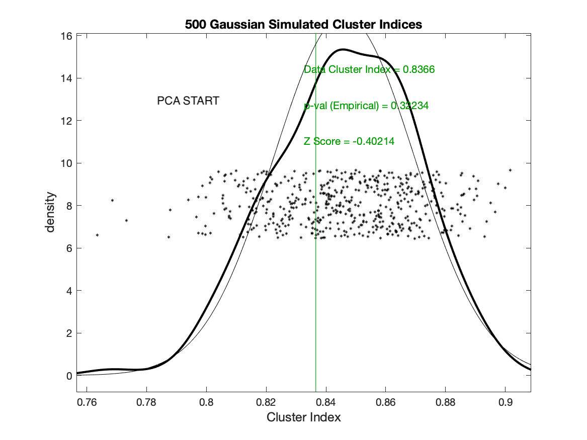
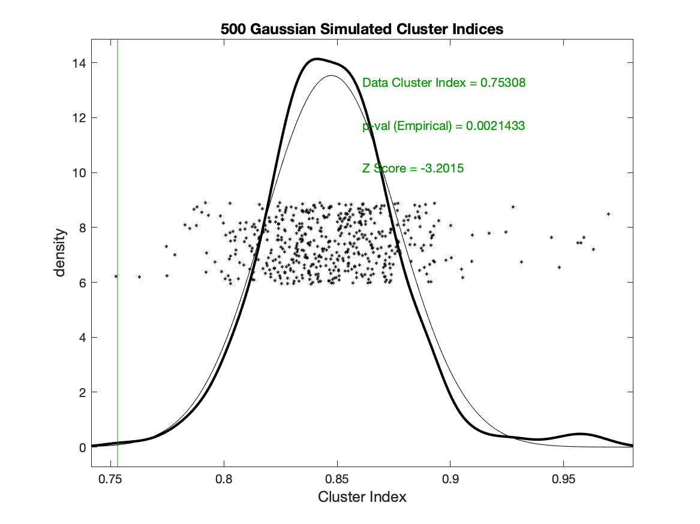
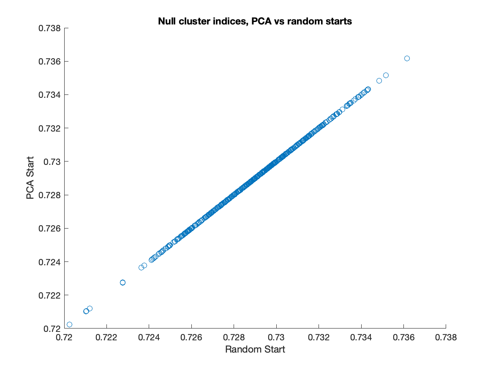

# Analysis of PCA starts vs random starts in SigClust

### 1. Initialization schemes for k-means clustering
The k-means algorithm is known to get stuck in local minima, and a common way
to address this is to do multiple runs of the algorithm with different
initial positions of the centroids.

The k-means algorithms available in the Matlab standard library and in Python's scikit-learn library
both use the "k-means++" scheme for choosing the initial centroids, proposed by
[Arthur and Vassilvitskii in 2007](http://ilpubs.stanford.edu:8090/778/1/2006-13.pdf).

Under k-means++, the first centroid is chosen uniformly at random from the datapoints,
and the subsequent centroids are chosen randomly from the remaining datapoints,
weighted towards the points that are far from the closest already chosen centroid.

Since k-means++ is not deterministic, different runs will use different initial centroids,
and so it is still useful to use multiple runs to address the issue of local minima.
The Python scikit-learn default is 10
runs, while the Matlab default is 1 run.

Steve Marron has a deterministic procedure (`SigClust2MeanFastSM.m`) for using PCA in conjunction with k-means
to find the optimal 2-means clustering without requiring many random restarts.
This procedure was written the same year as the k-means++ initialization scheme
was published. The procedure is as follows:
1. Split the data into two initial clusters at the median score on
the PC1 direction
1. Using the centroids of these initial clusters as the initialization, refine
the clusters using the usual k-means algorithm
1. Project the data onto the subspace orthogonal to the mean-difference direction of the refined clusters
1. Goto (1), until `maxstep` directions have been used.
1. Among all these clusterings, pick the one that with the smallest cluster index.

### 2. A data example of why this matters in SigClust
The SigClust procedure relies heavily on finding optimal 2-means clusterings, and
provides options to use the PCA starts or random starts (with the k-means++ scheme) to find the optimal clusterings. The choice of PCA starts or random starts is used both to compute the data cluster index as well as the simulated null cluster indices.

For the following example I use a sample of 50 datapoints from
The Cancer Genome Atlas, with dimension 12,478.

If SigClust is used with the default setting of PCA starts (and `maxstep=1`), then the data cluster index is computed as .84, but if the random (k-means++) start is used (with no restarts) then the data cluster index is computed as .75.

This makes all the difference in statistical significance: the .84 CI from the PCA starts is not significant at p=.32, but the .75 CI is highly significant at p=.002.

*PCA start, maxstep=1*

*Random (k-means++) start, no restarts*

In the figures above, the null distributions are not exactly the same datapoints. Not only do they use different k-means initializations, they also do not use the same seed. However, the following figure shows that PCA starts versus random starts does not matter for the null distribution. In this figure, I compute the 2-means cluster index with both the PCA start and the random start for 500 simulations of the null multivariate gaussian distribution estimated from the kidney cancer data. Plotting the CIs with random start against the CIs with PCA start, we see that they coincide exactly:

Therefore the issue is only with the computation of the data cluster index. Analysts using the Matlab SigClust should be careful about using the default option of PCA starts.
